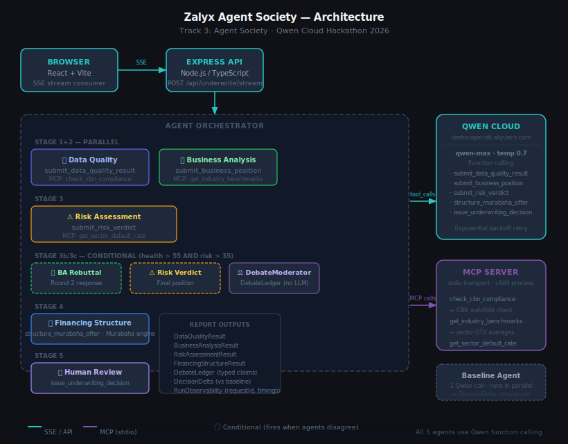

# Zalyx Agent Society

**Multi-Agent Merchant Underwriting System** — Qwen Cloud Hackathon, Track 3: Agent Society

Zalyx Agent Society is a five-agent underwriting workflow for merchant financing. It separates data quality, business analysis, risk review, financing structure, and final human review so judges and operators can inspect the decision instead of trusting one opaque model response.

[](./LICENSE)
[](https://www.alibabacloud.com/product/machine-learning)
[](https://github.com/alateefah/zalyx-agent-society/actions/workflows/ci.yml)

**Live deployment**

- App: http://139.129.19.5:3001/
- Health: http://139.129.19.5:3001/api/health

The live health check reports Qwen Cloud `mockMode: false` and Alibaba Cloud Tablestore `mockMode: false` on instance `zalyx-agent-db`.

---

## What it does

The system runs a full agent-society review for each merchant snapshot and compares it with a single-agent Qwen baseline. Every model-backed agent uses Qwen Cloud via DashScope-compatible chat completions with typed tool calls, while MCP tools add live compliance, sector benchmark, and portfolio default-rate evidence.

| Agent | Role | MCP Tool Used |
|---|---|---|
| Data Quality | Validates completeness and compliance | `check_cbn_compliance` |
| Business Analysis | Assesses revenue trajectory and sector fit | `get_industry_benchmarks` |
| Risk Assessment | Challenges the business case with default-rate evidence | `get_sector_default_rate` |
| Debate Round | Runs a rebuttal and final verdict when agents disagree | — |
| Financing Structure | Calculates Murabaha-compliant terms from GTV | — |
| Human Review | Synthesizes the evidence into a final decision | — |

The product is organized around merchant workspaces. Underwriters can search the portfolio, stream a new society run, review lightweight decision history, and reopen a permanent full report at `/merchants/:merchantId/decisions/:requestId`.

---

## Key design decisions

**Murabaha financing (Islamic finance compliant)**
Zalyx does not lend money. It purchases assets on the merchant's behalf at a disclosed cost price, then sells those assets to the merchant at a fixed sale price. The difference is Zalyx's profit margin — no interest, no compounding, no late fees.

```
Max sale price = % of merchant's avg monthly GTV (risk-tiered)
Min sale price = 50% of max sale price
Cost price     = selected sale price × (1 − profit margin)
Installment    = selected sale price ÷ tenor months
```

| Risk tier | GTV offer | Tenor | Profit margin |
|---|---|---|---|
| Low (0–35) | 25% of avg monthly GTV | 6 months | 10% |
| Moderate (35–65) | 15% of avg monthly GTV | 3 months | 15% |
| High (65–80) | 5% of avg monthly GTV | 2 months | 20% |
| Very high (80+) | Rejected | — | — |

Affordability cap: monthly installment must be ≤ 20% of avg monthly GTV. If the maximum sale price exceeds that, the cap is reduced until it fits.

The output is an approved **investment range**, not a model-picked single amount. The maximum is the largest exposure Zalyx will approve under policy; the minimum is a smaller customer-selectable ticket. The merchant can choose any amount inside the range, and the Murabaha sale price/profit are computed from the selected amount.

Offer cadence: Zalyx treats this as a **monthly review**, similar to a real cash-advance offer. The range is fixed for the latest completed monthly data period and remains valid until the next review window. Rerunning underwriting inside the same period should explain the same range, not search for a better amount.

**Conditional debate round**
The debate round (Stage 3b/3c) only fires when the Business Analyst's health score > 55 AND the Risk Officer's score > 35 — i.e. when agents genuinely disagree. Clear approvals and clear rejections skip it, saving LLM calls.

**Structured Qwen calls with policy-owned money fields**
Every model-backed agent submits its output via a structured tool call rather than prose:

| Agent | Tool |
|---|---|
| Data Quality | `submit_data_quality_result` |
| Business Analysis | `submit_business_position` |
| Risk Assessment | `submit_risk_verdict` |
| Financing Structure | `structure_murabaha_offer` |
| Human Review | `issue_underwriting_decision` |

This keeps agent evidence auditable: scores, risk factors, recommendations, and conditions are read from typed JSON arguments instead of scraped prose. The financing amounts are deliberately stricter: the min/max Murabaha range is computed by the deterministic policy engine, and Qwen is only allowed to explain the structure and conditions.

**MCP integration**
A dedicated MCP server (stdio transport, `@modelcontextprotocol/sdk`) exposes three tools that agents call during reasoning — not just pre-loaded context but live lookups that change what the agents say:

- `check_cbn_compliance` — blocks applications from CBN watchlist or restricted sectors before underwriting begins
- `get_industry_benchmarks` — gives the Business Analyst sector-specific GTV averages, active day norms, and completion rate benchmarks to compare this merchant against peers
- `get_sector_default_rate` — gives the Risk Agent Zalyx's historical default rates for this sector + risk tier, and suggests a minimum Murabaha profit margin

**DebateLedger**
When the debate round fires, a deterministic `DebateModerator` parses the transcript into typed `DebateClaim[]` objects — each with a `claimId`, evidence from both sides, and a resolution type (`claim_withdrawn`, `risk_concern_upheld`, `compromise_condition_set`, etc.). This makes the agent negotiation machine-readable and auditable, not just a chat log.

---

## Architecture

```
Browser (React + Vite)
  │
  │  Merchant workspaces + permanent decision URLs
  │  SSE stream: POST /api/underwrite/stream
  │  Parallel:   POST /api/baseline
  ▼
Express API (Node.js / TypeScript in Docker on Alibaba Cloud ECS)
  ├── Alibaba Cloud Tablestore (utils/tablestore.ts)
  │     ├── zalyx_merchants  (PK: id)
  │     └── zalyx_decisions  (PK: merchantId + requestId)
  │           └── decision_index GSI (decision, createdAt)
  ├── Local file storage
  │     └── local development → data/snapshots + data/decisions.local.json
  ▼
Agent Orchestrator
  │
  ├─ Stage 1+2 (parallel):
  │    ├── Data Quality Agent  ──────── MCP: check_cbn_compliance
  │    └── Business Analysis Agent ──── MCP: get_industry_benchmarks
  │
  ├─ Stage 3:
  │    └── Risk Assessment Agent ─────── MCP: get_sector_default_rate
  │
  ├─ Stage 3b/3c (conditional — only when agents disagree):
  │    ├── Business Analysis Agent (rebuttal)
  │    └── Risk Assessment Agent (final verdict)
  │         └── DebateModerator → DebateLedger (typed claims, deterministic)
  │
  ├─ Stage 4 (skipped if very high risk):
  │    └── Financing Structure Agent (Murabaha engine)
  │
  └─ Stage 5:
       └── Human Review Agent → Decision + DecisionDelta + RunObservability
  │
  ├── Qwen Cloud API (DashScope-compatible chat completions, qwen-max, tool calls)
  ├── MCP Server (stdio) ← mcp-server/index.ts
  │     ├── check_cbn_compliance
  │     ├── get_industry_benchmarks
  │     └── get_sector_default_rate
```



---

## Persistence — Alibaba Cloud Tablestore

Merchant table data is stored in **Alibaba Cloud Tablestore** (`utils/tablestore.ts`) — a serverless wide-column store. Decision history writes to Tablestore when `OTS_*` is configured, or to the local JSON decision store during local development.

| Table | Primary key | Notes |
|---|---|---|
| `zalyx_merchants` | `id` | Merchant profiles |
| `zalyx_decisions` | `merchantId` + `requestId` | Underwriting decisions |

A global secondary index (`decision_index`) on `(decision, createdAt)` allows efficient queries by decision type and recency.

**Runtime data model:** merchant snapshots are input data. Local development uses `DATA_BACKEND=local`: the API loads the three default demo merchants from `data/snapshots/*.json`, saves custom merchant snapshots back into that directory, calls Qwen Cloud for underwriting, and stores decisions in `data/decisions.local.json`.

On Alibaba ECS, use `DATA_BACKEND=tablestore` with the four `OTS_*` values. A confirmed deployment refresh can delete/recreate the merchant and decision tables, preload the three demo merchants from `data/snapshots/*.json`, then store new underwriting decisions in `zalyx_decisions`.

**Decision storage:** `DECISION_STORE=auto` writes decisions to Tablestore when `DATA_BACKEND=tablestore` and OTS is configured; otherwise it writes to `data/decisions.local.json`. Set `DECISION_STORE=local` to force local decision history during development.

---

## Quickstart (local)

### Prerequisites

- Node.js 20+
- A Qwen Cloud API key from [Alibaba Cloud DashScope](https://dashscope-intl.aliyuncs.com)

### 1. Clone and install

```bash
git clone https://github.com/alateefah/zalyx-agent-society.git
cd zalyx-agent-society

yarn install
cd frontend && yarn install && cd ..
```

### 2. Configure environment

```bash
cp .env.example .env
```

Edit `.env` — see `.env.example` for the full reference. At minimum:

```env
# Qwen Cloud (required for live agent calls)
QWEN_API_KEY=your_qwen_cloud_api_key_here
QWEN_MODEL=qwen-max
QWEN_API_BASE_URL=https://dashscope-intl.aliyuncs.com/compatible-mode/v1
PORT=3001

# Alibaba Cloud Tablestore (optional locally; required for cloud merchant table)
DATA_BACKEND=local
OTS_ENDPOINT=https://<instance>.<region>.ots.aliyuncs.com
OTS_INSTANCE=<your_instance_name>
OTS_ACCESS_KEY_ID=
OTS_ACCESS_KEY_SECRET=
DECISION_STORE=auto
LOCAL_MERCHANTS_DIR=data/snapshots
LOCAL_DECISIONS_FILE=data/decisions.local.json
```

> `QWEN_API_KEY` is required. If it is missing, the server refuses to start rather than returning fake agent analysis.

> Tablestore credentials are optional for local development only. With `DATA_BACKEND=local`, merchant rows come from `data/snapshots/*.json`, custom merchant JSON is saved there, and decisions persist through `data/decisions.local.json`. Qwen Cloud is still used for the underwriting decision.

### Cloud deployment reset

For a fresh Alibaba demo deployment, set these on the ECS host before starting Docker Compose:

```env
DATA_BACKEND=tablestore
RESET_TABLESTORE_ON_DEPLOY=true
CONFIRM_TABLESTORE_RESET=zalyx-agent-db
```

When the container starts, it deletes and recreates the configured Tablestore merchant and decision tables, seeds the three default merchants from `data/snapshots/*.json`, then starts the API. Leave `RESET_TABLESTORE_ON_DEPLOY=false` for ordinary restarts where existing decisions should be preserved.

### 3. Seed merchant table (optional)

```bash
yarn seed
```

With `OTS_*` configured, this loads the anonymized merchant snapshots from `data/snapshots/*.json` into the Alibaba Cloud Tablestore merchant table. It does not create fake historical decisions.

### 4. Run

```bash
yarn dev
```

Opens:
- Backend API: http://localhost:3001
- Frontend UI: http://localhost:5173

Published deployment:
- App: http://139.129.19.5:3001/
- Health: http://139.129.19.5:3001/api/health

---

## Demo merchants

Three real anonymized Zalyx merchants with different risk profiles:

| ID | Business type | Baseline | Multi-agent |
|---|---|---|---|
| ZALYX-001 | School | requires-clarification | **Approved** — debate surfaces term-fee seasonality |
| ZALYX-002 | Natural skin & hair | requires-clarification | **Requires clarification** — MCP sector benchmarks keep the range pending |
| ZALYX-003 | Freelancer | requires-clarification | **Rejected** — weak recent activity and high sector default rate are not overridden |

The decision quality difference is in the output structure: the multi-agent pipeline produces a formal `DebateResolution` record, typed `DebateLedger` claims, Murabaha installment schedule, and `RunObservability` for every run. The baseline produces a paragraph.

### Benchmark Results (committed — `benchmark/results.md`)

| Metric | Value |
|---|---|
| Merchants benchmarked | 3 |
| Decisions that differed (baseline vs multi-agent) | **2/3** |
| Debate round fired | **1/3** merchants |
| Total structured risk factors surfaced | 12 |
| Avg structured output completeness | **100%** |
| Avg actionability score | **73/100** |
| Avg baseline latency | 0.9s |
| Avg multi-agent latency | 4.0s |
| Qwen function calls per run | 8 (all 5 agents use structured tool output) |
| MCP calls per run | 3 (CBN compliance + sector benchmarks + default rate) |

Full per-merchant breakdown: [`benchmark/results.md`](benchmark/results.md). Raw JSON is generated locally and git-ignored.

Run yourself: `yarn benchmark`

---

## API Reference

### `POST /api/underwrite/stream`

Run the full 5-agent debate with **live SSE streaming**. Each agent's output is streamed as it completes — no waiting for the full pipeline.

**Body:** `ZalyxMerchantSnapshot` (see `utils/types.ts`)

**Response:** `text/event-stream` — emits `AgentProgressEvent` objects as agents complete, then a final `UnderwritingReport`.

### `POST /api/baseline`

Run the single-agent baseline (for Track 3 comparison).

**Body:** Same `ZalyxMerchantSnapshot`

**Response:** `BaselineReport` with decision, reasoning, and confidence.

### `GET /api/merchants`

Returns all merchants from the configured Tablestore merchant table.

### `GET /api/merchants/:id`

Returns a single merchant by ID.

### `GET /api/merchants/:merchantId/decisions`

Returns lightweight decision summaries for a merchant (no full report blob).

### `GET /api/merchants/:merchantId/decisions/:requestId`

Returns a single decision (full report + `createdAt`) by composite key.

### `GET /api/decisions/:merchantId`

Alias for merchant decision history.

### `GET /api/decisions?type=<value>`

Filter decisions across all merchants by decision type (e.g. `approved`, `rejected`).

### `GET /api/health`

```json
{
  "status": "ok",
  "ai": { "provider": "Qwen Cloud", "model": "qwen-max", "mockMode": false },
  "database": { "provider": "Alibaba Cloud Tablestore", "instance": "zalyx-agent-db", "mockMode": false },
  "timestamp": "..."
}
```

---

## Qwen Cloud integration

All five model-backed stages call `chatWithTools()` against Qwen Cloud's DashScope-compatible chat completions endpoint with typed tool definitions. Qwen returns a `tool_calls` object; the orchestrator reads `tool_calls[0].function.arguments` as structured JSON:

```typescript
const response = await client.chat.completions.create({
  model: "qwen-max",
  messages: [...],
  tools: [SUBMIT_RISK_VERDICT_TOOL],   // e.g. for Risk Assessment Agent
  tool_choice: "auto",
});
const args = JSON.parse(
  response.choices[0].message.tool_calls[0].function.arguments
);
// → { risk_score: 42, risk_factors: [...], recommendation: "approve_with_conditions" }
```

For financing, the numeric range is not taken from the model. `utils/policy-metrics.ts` computes deterministic monthly policy inputs from the merchant snapshot, and `utils/murabaha-engine.ts` computes the approved min/max range from GTV, risk tier, tenor, margin, and affordability policy. Qwen explains the terms and disbursement conditions around that fixed range. Each report stores a `FinancialSnapshotSummary`, so repeated runs against the same input have the same snapshot fingerprint and range; new external merchant data produces a new snapshot and may produce a new range.

The MCP server runs as a stdio child process. Agents call it mid-reasoning:

```typescript
// Data Quality Agent
const cbn = await mcpClient.checkCbnCompliance({ merchant_id, business_type });
// → { status: "clear", can_proceed: true, details: "..." }

// Business Analysis Agent
const bench = await mcpClient.getIndustryBenchmarks({ business_type, merchant_monthly_gtv });
// → { benchmarks: {...}, merchant_vs_sector: { gtv_assessment: "..." } }

// Risk Assessment Agent
const dr = await mcpClient.getSectorDefaultRate({ business_type, risk_tier: "moderate" });
// → { historical_default_rate_pct: 6.4, suggested_murabaha_margin_floor: 15 }
```

All MCP calls degrade gracefully — if the server is unavailable, agents proceed without the extra context rather than failing the request.

---

## Project structure

```
zalyx-agent-society/
├── agents/
│   ├── baseline-agent.ts            # Single-agent baseline (Track 3 comparison)
│   ├── business-analysis-agent.ts   # MCP: get_industry_benchmarks
│   ├── data-quality-agent.ts        # MCP: check_cbn_compliance
│   ├── debate-moderator.ts          # Deterministic DebateLedger builder (no LLM)
│   ├── financing-structure-agent.ts # Murabaha structuring via murabaha-engine
│   ├── human-review-agent.ts        # Final decision (function calling)
│   └── risk-assessment-agent.ts     # MCP: get_sector_default_rate
├── mcp-server/
│   └── index.ts                     # MCP server (stdio) — 3 underwriting tools
├── orchestration/
│   └── agent-orchestrator.ts        # Parallel stages, conditional debate, SSE events
├── utils/
│   ├── mcp-client.ts                # MCP client singleton with clean shutdown
│   ├── murabaha-engine.ts           # Pure Murabaha math (testable, no side effects)
│   ├── qwen-client.ts               # Qwen Cloud (DashScope) API client
│   ├── tablestore.ts                # Alibaba Cloud Tablestore + local file storage
│   └── types.ts                     # All types: snapshot, report, ledger, observability
├── benchmark/
│   ├── run.ts                       # Benchmark runner (yarn benchmark)
│   ├── results.md                   # Committed benchmark results
│   └── results.json                 # Local generated raw data (git-ignored)
├── data/
│   ├── snapshots/                   # Anonymized merchant JSON snapshots for seed/benchmark input
│   └── decisions.local.json         # Local decision store (git-ignored)
├── tests/
│   ├── murabaha.test.ts             # 25 unit tests for Murabaha engine
│   ├── orchestrator.test.ts         # Integration tests for the agent pipeline
│   └── tablestore.test.ts           # Persistence contract tests
├── frontend/                        # React + Vite UI
│   └── src/
│       ├── pages/                   # Portfolio, workspace, decision report routes
│       ├── components/              # Report, merchant, history, processing UI
│       ├── hooks/                   # Merchant, underwriting, health hooks
│       └── utils/                   # API client and constants
├── .github/
│   └── workflows/ci.yml             # CI: type-check, frontend build, docker build
├── server.ts                        # Express API + SSE endpoint
├── Dockerfile
├── docker-compose.yml
└── .env.example
```

---

## Tests

```bash
yarn test
```

- `tests/murabaha.test.ts` — 25 unit tests: risk tier selection, GTV pricing, affordability cap, installment math
- `tests/orchestrator.test.ts` — integration tests for pipeline completion, debate gates, streaming progress, and report contracts
- `tests/tablestore.test.ts` — persistence tests for local fallback and Tablestore-shaped decision access

Jest exits cleanly because `afterAll()` closes the MCP stdio child process explicitly.

---

## Docker

```bash
docker compose up --build
```

Local Docker app: http://localhost:3001. Docker build is verified on every push via GitHub Actions.

Published ECS app: http://139.129.19.5:3001/.

---

## Deploy to Alibaba Cloud ECS

```bash
# On your ECS instance (Ubuntu 22.04):
curl -fsSL https://get.docker.com | sh
git clone https://github.com/alateefah/zalyx-agent-society.git
cd zalyx-agent-society
echo "QWEN_API_KEY=your_key" > .env
echo "QWEN_MODEL=qwen-max" >> .env
echo "OTS_ENDPOINT=https://<instance>.<region>.ots.aliyuncs.com" >> .env
echo "OTS_INSTANCE=zalyx-agent-db" >> .env
echo "OTS_ACCESS_KEY_ID=your_access_key_id" >> .env
echo "OTS_ACCESS_KEY_SECRET=your_access_key_secret" >> .env
docker compose up -d --build
curl http://localhost:3001/api/health
```

The deployed health response should show:

- `ai.provider`: `Qwen Cloud`
- `ai.mockMode`: `false`
- `database.provider`: `Alibaba Cloud Tablestore`
- `database.instance`: `zalyx-agent-db`
- `database.mockMode`: `false`

Hackathon evidence files:

- [`utils/qwen-client.ts`](utils/qwen-client.ts) — Qwen Cloud via DashScope-compatible chat completions and tool calls
- [`utils/tablestore.ts`](utils/tablestore.ts) — Alibaba Cloud Tablestore persistence
- [`Dockerfile`](Dockerfile) — single-image Docker deployment for Alibaba Cloud ECS

---

## Hackathon

**Event:** Qwen Cloud Hackathon 2026
**Track:** Track 3 — Agent Society
**Deadline:** July 9, 2026 @ 2:00pm PDT
**Repo:** https://github.com/alateefah/zalyx-agent-society

---

## License

MIT — see [LICENSE](./LICENSE)
