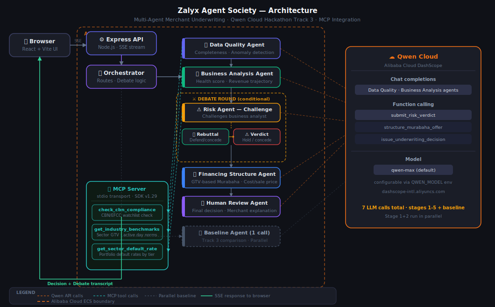

# Zalyx Agent Society

**Multi-Agent Merchant Underwriting System** — Qwen Cloud Hackathon, Track 3: Agent Society

A five-agent debate pipeline that makes smarter, more transparent merchant financing decisions than any single AI call. Built on real anonymized data from [Zalyx](https://zalyx.com), a Nigerian fintech platform serving 700+ merchants.

[](./LICENSE)
[](https://www.alibabacloud.com/product/machine-learning)

---

## What it does

Five specialized AI agents debate every financing application, each enriched with live data from a custom **MCP (Model Context Protocol) server**:

| Agent | Role | MCP Tool Used |
|---|---|---|
| 🔍 Data Quality | Validates completeness, flags anomalies | `check_cbn_compliance` |
| 📈 Business Analysis | Assesses revenue trajectory, health score | `get_industry_benchmarks` |
| ⚠️ Risk Assessment | **Challenges** the Business Agent's assumptions | `get_sector_default_rate` |
| 🔄 Debate Round | Business Agent **rebuts**; Risk Agent issues **final verdict** | — |
| 💰 Financing Structure | Designs Murabaha-compliant terms from GTV | — |
| 👤 Human Review | Synthesises the full debate → final decision | — |

The system also runs a **single-agent baseline** in parallel — same data, one LLM call — to demonstrate measurable improvement from the multi-agent approach.

---

## Key design decisions

**Murabaha financing (Islamic finance compliant)**
Zalyx does not lend money. It purchases assets on the merchant's behalf at a disclosed cost price, then sells those assets to the merchant at a fixed sale price. The difference is Zalyx's profit margin — no interest, no compounding, no late fees.

```
Sale price  = % of merchant's avg monthly GTV (risk-tiered)
Cost price  = sale price × (1 − profit margin)
Installment = sale price ÷ tenor months
```

| Risk tier | GTV offer | Tenor | Profit margin |
|---|---|---|---|
| Low (0–35) | 25% of avg monthly GTV | 6 months | 10% |
| Moderate (35–65) | 15% of avg monthly GTV | 3 months | 15% |
| High (65–80) | 5% of avg monthly GTV | 2 months | 20% |
| Very high (80+) | Rejected | — | — |

Affordability cap: monthly installment must be ≤ 20% of avg monthly GTV. If it exceeds that, the sale price is reduced until it fits.

**Conditional debate round**
The debate round (Stage 3b/3c) only fires when the Business Analyst's health score > 55 AND the Risk Officer's score > 35 — i.e. when agents genuinely disagree. Clear approvals and clear rejections skip it, saving LLM calls.

**MCP integration**
A dedicated MCP server (stdio transport, `@modelcontextprotocol/sdk`) exposes three tools that agents call during reasoning — not just pre-loaded context but live lookups that change what the agents say:

- `check_cbn_compliance` — blocks applications from CBN watchlist or restricted sectors before underwriting begins
- `get_industry_benchmarks` — gives the Business Analyst sector-specific GTV averages, active day norms, and completion rate benchmarks to compare this merchant against peers
- `get_sector_default_rate` — gives the Risk Agent Zalyx's historical default rates for this sector + risk tier, and suggests a minimum Murabaha profit margin

---

## Architecture

```
Browser (React + Vite)
  │
  │  SSE stream: POST /api/underwrite/stream
  │  Parallel:   POST /api/baseline
  ▼
Express API (Node.js / TypeScript)
  │
  ▼
Agent Orchestrator
  │
  ├─ Stage 1+2 (parallel):
  │    ├── Data Quality Agent  ──────── MCP: check_cbn_compliance
  │    └── Business Analysis Agent ──── MCP: get_industry_benchmarks
  │
  ├─ Stage 3:
  │    └── Risk Assessment Agent ─────── MCP: get_sector_default_rate
  │
  ├─ Stage 3b/3c (conditional — only when agents disagree):
  │    ├── Business Analysis Agent (rebuttal)
  │    └── Risk Assessment Agent (final verdict)
  │
  ├─ Stage 4 (skipped if very high risk):
  │    └── Financing Structure Agent
  │
  └─ Stage 5:
       └── Human Review Agent → Decision
  │
  ├── Qwen Cloud API (DashScope, qwen-max, function calling)
  └── MCP Server (stdio) ← mcp-server/index.ts
        ├── check_cbn_compliance
        ├── get_industry_benchmarks
        └── get_sector_default_rate
```



---

## Quickstart (local)

### Prerequisites

- Node.js 20+
- A Qwen Cloud API key from [Alibaba Cloud DashScope](https://dashscope-intl.aliyuncs.com)

### 1. Clone and install

```bash
git clone https://github.com/alateefah/zalyx-agent-society.git
cd zalyx-agent-society

yarn install
cd frontend && yarn install && cd ..
```

### 2. Configure environment

```bash
cp .env.example .env
```

Edit `.env`:

```env
QWEN_API_KEY=your_qwen_cloud_api_key_here
QWEN_MODEL=qwen-max
QWEN_API_BASE_URL=https://dashscope-intl.aliyuncs.com/compatible-mode/v1
PORT=3001
```

> **No API key?** The system runs in mock mode automatically — all five agents return realistic demo responses. The header shows a pulsing **"Mock mode"** badge so you always know which mode you're in.

### 3. Run

```bash
yarn dev
```

Opens:
- Backend API: http://localhost:3001
- Frontend UI: http://localhost:5173

---

## Demo merchants

Three real anonymized Zalyx merchants with different risk profiles:

| ID | Business type | Profile | Expected outcome |
|---|---|---|---|
| ZALYX-001 | School | Term-fee payment pattern, moderate risk | **Approved** with conditions |
| ZALYX-002 | Natural products | Small merchant, low receivables | **Requires clarification** |
| ZALYX-003 | Freelancer | 0 active days (30d), high uncollected receivables | **Rejected** |

ZALYX-001 is the most illustrative for *decision quality*: both approaches may reach approval, but the multi-agent pipeline produces a formal `DebateResolution` record — disputed claims, rebuttal, verdict, and disbursement conditions — rather than a prose paragraph. The term-fee seasonality pattern is explicitly surfaced and cited.

### Benchmark Results (committed — `benchmark/results.md`)

| Metric | Value |
|---|---|
| Merchants benchmarked | 3 |
| Decisions that differed (baseline vs multi-agent) | **3/3** |
| Debate round fired | **3/3** merchants |
| Total structured risk factors surfaced | 9 |
| Avg structured output completeness | **100%** |
| Avg actionability score | **100/100** |
| Avg baseline latency | 0.5s |
| Avg multi-agent latency | 5.6s |
| Qwen function calls per run | 8 (all 5 agents use structured tool output) |
| MCP calls per run | 3 (CBN compliance + sector benchmarks + default rate) |

Full per-merchant breakdown: [`benchmark/results.md`](benchmark/results.md) · raw data: [`benchmark/results.json`](benchmark/results.json)

Run yourself: `yarn benchmark`

---

## API Reference

### `POST /api/underwrite/stream`

Run the full 5-agent debate with **live SSE streaming**. Each agent's output is streamed as it completes — no waiting for the full pipeline.

**Body:** `ZalyxMerchantSnapshot` (see `utils/types.ts`)

**Response:** `text/event-stream` — emits `AgentProgressEvent` objects as agents complete, then a final `UnderwritingReport`.

### `POST /api/baseline`

Run the single-agent baseline (for Track 3 comparison).

**Body:** Same `ZalyxMerchantSnapshot`

**Response:** `BaselineReport` with decision, reasoning, and confidence.

### `GET /api/health`

```json
{ "status": "ok", "mockMode": false, "model": "qwen-max", "timestamp": "..." }
```

---

## Qwen Cloud integration

### Chat completions
Standard reasoning for Data Quality and Business Analysis agents:

```typescript
const response = await client.chat.completions.create({
  model: "qwen-max",
  messages: [...],
  temperature: 0.7,
});
```

### Function calling
Risk Assessment, Financing Structure, and Human Review agents use Qwen function calling to return structured JSON:

```typescript
const response = await client.chat.completions.create({
  model: "qwen-max",
  messages: [...],
  tools: [SUBMIT_RISK_VERDICT_TOOL],
  tool_choice: "auto",
});
// → response.choices[0].message.tool_calls[0].function.arguments
```

### MCP server
The MCP server runs as a stdio child process alongside the Express API. Agents call it via `mcpClient` which manages the lifecycle:

```typescript
// Data Quality Agent
const cbn = await mcpClient.checkCbnCompliance({ merchant_id, business_type });
// → { status: "clear", can_proceed: true, details: "..." }

// Business Analysis Agent
const bench = await mcpClient.getIndustryBenchmarks({ business_type, merchant_monthly_gtv });
// → { benchmarks: {...}, merchant_vs_sector: { gtv_assessment: "..." } }

// Risk Assessment Agent
const dr = await mcpClient.getSectorDefaultRate({ business_type, risk_tier: "moderate" });
// → { historical_default_rate_pct: 6.4, interpretation: "...", suggested_murabaha_margin_floor: 15 }
```

All MCP calls degrade gracefully — if the server is unavailable, agents proceed without the extra context rather than failing the request.

---

## Project structure

```
zalyx-agent-society/
├── agents/
│   ├── baseline-agent.ts           # Single-agent baseline (Track 3 comparison)
│   ├── business-analysis-agent.ts  # MCP: get_industry_benchmarks
│   ├── data-quality-agent.ts       # MCP: check_cbn_compliance
│   ├── financing-structure-agent.ts # GTV-based Murabaha structuring
│   ├── human-review-agent.ts       # Final decision (function calling)
│   └── risk-assessment-agent.ts    # MCP: get_sector_default_rate
├── mcp-server/
│   └── index.ts                    # MCP server (stdio) — 3 underwriting tools
├── orchestration/
│   └── agent-orchestrator.ts       # Parallel stages, conditional debate, SSE events
├── utils/
│   ├── mcp-client.ts               # MCP client singleton
│   ├── qwen-client.ts              # Qwen Cloud (DashScope) API client
│   └── types.ts                    # ZalyxMerchantSnapshot + all report types
├── data/
│   └── snapshots/                  # Anonymized merchant JSON snapshots
├── docs/
│   └── architecture.svg            # Architecture diagram
├── frontend/                       # React + Vite UI
│   └── src/
│       ├── App.tsx
│       └── App.css
├── server.ts                       # Express API + SSE endpoint
├── Dockerfile
├── docker-compose.yml
└── .env.example
```

---

## Docker

```bash
docker compose up --build
```

App available at http://localhost:3001

---

## Deploy to Alibaba Cloud ECS

```bash
# On your ECS instance (Ubuntu 22.04):
curl -fsSL https://get.docker.com | sh
git clone https://github.com/alateefah/zalyx-agent-society.git
cd zalyx-agent-society
echo "QWEN_API_KEY=your_key" > .env
echo "QWEN_MODEL=qwen-max" >> .env
docker compose up -d --build
curl http://localhost:3001/api/health
```

---

## Hackathon

**Event:** Qwen Cloud Hackathon 2026
**Track:** Track 3 — Agent Society
**Deadline:** July 9, 2026 @ 2:00pm PDT

---

## License

MIT — see [LICENSE](./LICENSE)
