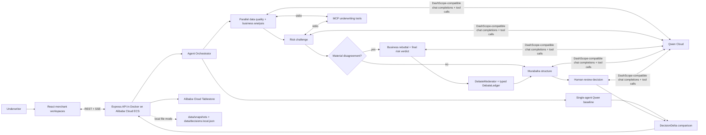

# Zalyx Agent Society Architecture

## Live System

- App: http://139.129.19.5:3001/
- Health: http://139.129.19.5:3001/api/health

The deployed service runs one Docker image on Alibaba Cloud ECS. The image
contains the Express API, MCP stdio server, and compiled React frontend. In the
live environment, `/api/health` reports Qwen Cloud with `mockMode: false` and
Alibaba Cloud Tablestore instance `zalyx-agent-db` with `mockMode: false`.

The committed visual architecture diagram is [`architecture.svg`](../architecture.svg).

## Runtime Path

| Layer | Evidence |
|---|---|
| Frontend | React 19 + Vite merchant workspaces, streamed progress, permanent report URLs |
| API | `server.ts` exposes health, merchant, decision, SSE underwriting, and baseline routes |
| Agent society | `orchestration/agent-orchestrator.ts` coordinates five specialized agents and conditional debate |
| Qwen Cloud | `utils/qwen-client.ts` sends DashScope-compatible chat completions with typed tool definitions |
| MCP | `mcp-server/index.ts` exposes compliance, benchmark, and default-rate tools over stdio |
| Persistence | `utils/tablestore.ts` provisions and queries Alibaba Cloud Tablestore tables |
| Deployment | `Dockerfile` and `docker-compose.yml` run the API and built frontend on Alibaba Cloud ECS |

## Staged Orchestration

| Stage | Execution | Output |
|---|---|---|
| 1 + 2 | Data Quality and Business Analysis run concurrently | Integrity score, compliance result, and sector-relative business position |
| 3 | Risk Assessment challenges the business position | Typed verdict grounded by an MCP default-rate lookup |
| 3b + 3c | Runs only when health is above 55 and risk is above 35 | Rebuttal, final verdict, and deterministic DebateLedger |
| 4 | Skipped at the very-high-risk gate | Deterministic monthly Murabaha min/max range with risk-tier pricing, affordability cap, and review-window validity |
| 5 | Human Review synthesizes all evidence | Final decision, conditions, and audit-ready rationale |

The single-agent baseline starts alongside the society run. Its result is
attached as a `DecisionDelta`, making the quality and latency tradeoff visible
for the same merchant snapshot.

## Tablestore Model

| Table | Primary key | Purpose |
|---|---|---|
| `zalyx_merchants` | `id` | Durable merchant snapshots and workspace recovery |
| `zalyx_decisions` | `merchantId`, `requestId` | Immutable report and audit envelope |

`decision_index` is a global secondary index on `decision` and `createdAt`, used
for cross-merchant queries by decision type. Merchant history requests retrieve
projected summaries, while permanent report URLs perform a composite-key point
read for the full report.

Local development uses `DATA_BACKEND=local`: merchants are read/written from
`data/snapshots/*.json`, custom merchant JSON is appended as snapshot files, and
decision history is stored in `data/decisions.local.json`. Qwen Cloud is still
called for underwriting; local mode only changes persistence.

Alibaba ECS uses `DATA_BACKEND=tablestore` with `OTS_ENDPOINT`, `OTS_INSTANCE`,
`OTS_ACCESS_KEY_ID`, and `OTS_ACCESS_KEY_SECRET`. On a confirmed deployment
refresh, `RESET_TABLESTORE_ON_DEPLOY=true` plus
`CONFIRM_TABLESTORE_RESET=<OTS_INSTANCE>` clears the configured OTS tables,
recreates them, preloads the three default merchant snapshots, then stores new
underwriting decisions in `zalyx_decisions`.

## Typed Model Boundary

Every model-backed agent submits a named Qwen tool call. The system does not
scrape prose for scores or decisions. Tool arguments map into TypeScript result
contracts, and the final report includes:

- Agent score objects and debate transcript
- `DebateResolution` and claim-level `DebateLedger`
- Deterministic `FinancingStructureResult` with a customer-selectable min/max investment range and monthly review window
- `FinancialSnapshotSummary` with the input fingerprint and snapshot metrics used for that range
- Baseline `DecisionDelta`
- `RunObservability` with request ID, model, call counts, timings, and gates

## Failure Handling

- Missing Qwen credentials fail fast; the runtime does not invent agent analysis.
- MCP lookups degrade gracefully instead of aborting underwriting.
- SSE emits explicit error events and closes the response.
- Decisions are persisted only after a full report is produced.
- Tablestore startup failure is surfaced as an error instead of silently changing data source.

## Scaling Path

The API and orchestrator are stateless after persistence, so multiple ECS
instances can share one Tablestore instance. Composite decision keys avoid
cross-merchant scans, projected history reads reduce response size, and the
first two model stages already execute concurrently.
